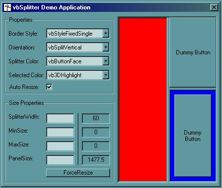



## Splitter Active\-X control for VB

### Description

This control creates a splitter bar with 2 resizable panels. The panels are adjustable by a specifying the size of the Child1 panel through the PanelSize property. It also includes minimum and maxmimum size parameters. It is well commented and also provides a demo application to explain all the options. I would also like to thank Mark Joyal for his great SplitterControl on which this is based. His control provides a way to resize based by a percentage, while mine provides a way to resize based on a size value.

Since this is my first Active-X control, I would really appreciate your votes and any feedback you can provide.
 
### More Info
 

             |
---                |---
**Submitted On**   |2001-01-20 18:37:12
**By**             |[Matthew Hood](https://github.com/Planet-Source-Code/PSCIndex/blob/master/ByAuthor/matthew-hood.md)
**Level**          |Intermediate
**User Rating**    |4.8 (19 globes from 4 users)
**Compatibility**  |VB 6\.0
**Category**       |[Custom Controls/ Forms/  Menus](https://github.com/Planet-Source-Code/PSCIndex/blob/master/ByCategory/custom-controls-forms-menus__1-4.md)
**World**          |[Visual Basic](https://github.com/Planet-Source-Code/PSCIndex/blob/master/ByWorld/visual-basic.md)
**Archive File**   |[CODE\_UPLOAD140001202001\.zip](https://github.com/Planet-Source-Code/matthew-hood-splitter-active-x-control-for-vb__1-14592/archive/master.zip)

